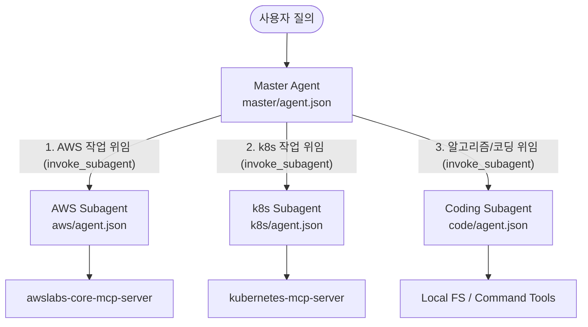

# Antigravity CLI 에이전트 및 MCP 구축 가이드

이 리포지토리는 Antigravity CLI(`agy`)의 환경 설정 파일들과 전역 플러그인 에이전트 정의를 보관하는 공간입니다. 
본 문서는 **1개의 마스터 컨트롤 에이전트와 3개의 전문 서브 에이전트(AWS, k8s, Coding)를 Subagent 오케스트레이션 아키텍처**로 안전하고 투명하게 구축하기 위한 상세 설계서입니다.

---

## 📂 1. 최종 디렉토리 아키텍처 설계

Antigravity CLI 가이드를 준수하여, 모든 전역 에이전트는 **전역 플러그인(`global-agents`)** 내부에 명확히 격리 배치합니다.

```text
~/.gemini/
├── config/
│   ├── mcp_config.json          # MCP 서버 구동 정의 (AWS, k8s 등)
│   ├── settings.json            # 사용자 세팅 및 실행 권한 목록
│   └── plugins/
│       └── global-agents/
│           ├── plugin.json      # 플러그인 정의 파일
│           └── agents/          # 각 커스텀 에이전트 정의 공간
│               ├── master/
│               │   └── agent.json  # [Master] 오케스트레이터 에이전트
│               ├── aws/
│               │   └── agent.json  # [Sub] AWS 전문가 에이전트
│               ├── k8s/
│               │   └── agent.json  # [Sub] k8s 전문가 에이전트
│               └── code/
│                   └── agent.json  # [Sub] 코딩/알고리즘 에이전트
└── README.md                    # 본 가이드라인 문서
```

---

## 🛠️ 2. 에이전트별 MCP 서버 및 구동 설정

각 에이전트가 활용할 공식 MCP(Model Context Protocol) 서버 사양 및 스토어 설정입니다. 전역 관리 파일인 `~/.gemini/config/mcp_config.json`에 정의됩니다.

### 1) AWS 에이전트 (`aws`)
* **역할:** AWS 자격 증명 세션을 감지하여 인프라 자원을 조회, 관리 및 아키텍처 트러블슈팅 수행
* **공식 MCP 서버:** `awslabs-core-mcp-server`
* **구동 명령어:** `uvx awslabs.core-mcp-server@latest`

### 2) Kubernetes 에이전트 (`k8s`)
* **역할:** k8s 클러스터 리소스 모니터링, Karpenter 스케일링 설정 및 Helm 배포 관리
* **공식 MCP 서버:** `kubernetes`
* **구동 명령어:** `npx -y kubernetes-mcp-server@latest`

### 3) Coding 에이전트 (`code`)
* **역할:** 알고리즘 최적화 코드 작성, 복잡한 SQL 쿼리 설계 및 CS 지식 문답 해결
* **공식 MCP 서버:** 별도의 외부 MCP 없이 로컬 파일 시스템 제어(`view_file`, `replace_file_content` 등) 및 터미널 쉘(`run_command`)의 기본 도구를 연동하여 수행.

---

## 🤖 3. Master-Subagent 작동 구조 및 구축 원리

Antigravity 2.0 환경에서 1개의 Master가 3개의 Subagent를 제어하는 오케스트레이션은 다음과 같이 구축됩니다.



### 구축 핵심 원리
1. **Master 에이전트의 권한 위임:** 
   * `master/agent.json` 내의 `toolNames` 목록에 서브 에이전트를 정의하고 제어할 수 있는 Antigravity 핵심 도구(`define_subagent`, `invoke_subagent`, `send_message`)들을 바인딩하거나, `"*" `로 모든 권한을 오픈합니다.
2. **오케스트레이션 지침 (System Prompt):**
   * Master 에이전트의 프롬프트 내에 *"사용자의 요청 성격에 따라 AWS 인프라는 `/aws`에, 쿠버네티스는 `/k8s`에, 코딩 및 SQL은 `/code` 하위 에이전트에 위임하여 병렬로 결과를 취합하고 보고하십시오"* 라는 페르소나 및 지침을 명확히 명시합니다.
3. **Subagent의 독립성:**
   * 서브 에이전트들은 각각 담당 전문 도구(AWS MCP, k8s MCP 등)만 장착하여 가볍게 유지하되, 마스터의 위임을 받아 독립적인 컨텍스트 안에서 작업을 완수하고 보고하도록 세팅합니다.

---

## 🚀 4. 구축 단계 계획

1. **설정 파일 준비:** `mcp_config.json`에 AWS 및 k8s MCP 구동 명령어를 기술합니다.
2. **플러그인 생성:** `plugins/global-agents/plugin.json` 파일을 작성하여 플러그인 껍데기를 등록합니다.
3. **에이전트 스키마 작성:** `master/`, `aws/`, `k8s/`, `code/` 하위에 각각 `agent.json`을 알맞은 `customAgentSpec` 규격으로 작성합니다.
4. **활성화:** `agy plugin enable global-agents`를 실행하여 시스템에 등록 및 검증합니다.
